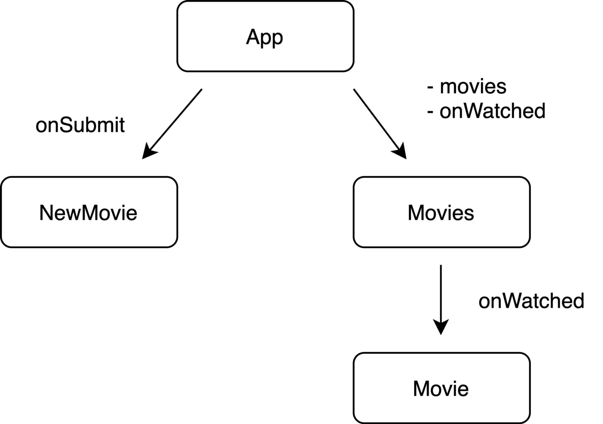
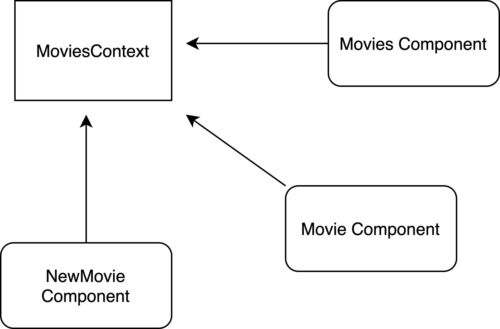

Managing state is an important part of an application. Developers usually come to libraries like Redux for a solution.
However, people often misuse the library, for example, they put all state to Redux even the local state like if a
sidebar is open or not.

In this post, I will walk you through a simple application to demonstrate an efficient way to manage state with hooks
and context API. This approach brings many benefits such as replacing Redux so one less library to maintain in your
application and solving the prop drilling problem.

**What we build**: a movie list application in which the user can add a new movie and mark a movie as watched.

**How we would build it before**: we handle state in a common parent component and pass props down to children
components.

 _Passing props to children_

Because Movies and NewMovie components need to access the same state, we
[lift the state up](https://reactjs.org/docs/lifting-state-up.html) to the App component which is the central state
management. Because the Movie component needs a method to modify the state (mark a movie as watched), the App passes
that method as a prop to Movies, and then from Movies to Movie. Movies component does not use the method `onWatched`,
but still needs to accept it as a prop so that it can pass the prop down to the child Movie. Imagine there are more
components, more children, and more props to pass, the application will become difficult to maintain and develop. This
problem is called **props drilling**. You can explore this implementation
[here](https://codesandbox.io/s/jovial-grass-wid9x).

 _We hook the components to the
MoviesContext_

<hr />

Let’s start by making the skeleton for MovieContext

```javascript
/**
initialMovies = [
  {
    id: uuidv4(),
    title: 'The Godfather',
    year: 1972,
    watched: false,
  },
  {
    id: uuidv4(),
    title: 'Inception',
    year: 2010,
    watched: false,
  },
  ...
]
*/
import { initialMovies } from './initialState';

// Create a context with by calling React.createContext()
const MoviesContext = React.createContext();

// initial reducer
const moviesReducer = (state, action) => {
  return state;
};

/**
state can contain more such as a loading status, and error state. e.g.
{
  status: 'loading',
  movies: [],
  error: null,
}
*/
const initialState = {
  movies: initialMovies,
};

// Create a custom MoviesProvider for the context
export const MoviesProvider = props => {
  const [state, dispatch] = React.useReducer(moviesReducer, initialState);

  // useMemo to optimize the context value
  const value = React.useMemo(() => ({ state, dispatch }), [state]);

  return <MoviesContext.Provider value={value} {...props} />;
};

// Custom hook useMoviesContext
export const useMoviesContext = () => {
  const context = React.useContext(MoviesContext);

  if (!context) {
    throw new Error('useMoviesContext must be used inside a MoviesProvider');
  }

  const { state, dispatch } = context;
  const { movies } = state;

  return { movies };
};
```

We first create the context by calling `React.createContext()` which returns a context object. The context object
consists of a pair of components: `Provider` and `Consumer` . A Provider provides context value for its consuming
children to subscribe to the change.

> Every Context object comes with a Provider React component that allows consuming components to subscribe to context
> changes ([React docs](https://reactjs.org/docs/context.html))

We make `MoviesProvider` to abstract the use of the Provider. Here I use `useReducer` to manage the state, but you can
also use `useState` if it suits you. Whenever the value props of `MoviesContext.Provider` changes, all its consuming
children will re-render. Therefore, I use `useMemo` to optimize the value. (More on `useMemo`
[here](https://reactjs.org/docs/hooks-reference.html#usememo))

As I said earlier, the context object comes with a Provider and a Consumer. Before hooks, we have to make use of
Consumer like:

```jsx
<MyContext.Consumer>
  {value => /* render something based on the context value */}
</MyContext.Consumer>
```

With the introduction of hooks since React 16.8, there is a better way of consuming context value without explicitly
using `Consumer`, the `useContext`. I create the custom hook `useMoviesContext` to contain all the logic to update the
state (you will see later). If `useMoviesContext` is not used inside `MoviesProvider`, then we throw an error for the
application to fail early because that is not what we wanted. For now, `useMoviesContext` only returns the movies array.

Now we have a movies list in the context, let’s hook it up to the Movies component.

<hr />

Let’s quickly compose the App component.

```jsx
export const App = () => {
  return (
    <div className="App">
      <MoviesProvider>
        <NewMovie />
        <Movies />
      </MoviesProvider>
    </div>
  );
};
```

Our App component looks tidy with no props passing around the Movies and NewMovie components. Those two components are
children of MoviesProvider, so they can correctly consume the value from MoviesContext.

## Movies component

```jsx
export const Movies = () => {
  const { movies } = useMoviesContext();

  return (
    <section className="Movies">
      <h2>My Movies</h2>
      {movies.map(movie => (
        <Movie key={movie.id} movie={movie} />
      ))}
    </section>
  );
};
```

Movies component can easily hook up to context by calling useMoviesContext

So how do we consume movies array from the context? By just calling `useMoviesContext` hook, we can get the movies and
render them.

For individual Movie component, we need a movie to render and a _method_ to mark the movie as watched.

```jsx
export const Movie = ({ movie }) => {
  const { markWatchedMovie } = useMoviesContext();

  const handleCheckboxChange = () => {
    markWatchedMovie(movie.id);
  };

  return (
    <article className="Movie">
      <h3>{movie.title}</h3>
      <p>{movie.year}</p>
      <div className="Movie-actions">
        <label className="Movie-watched">
          <input type="checkbox" checked={movie.watched} onChange={handleCheckboxChange} />
          Watched
        </label>
      </div>
    </article>
  );
};
```

In the Movie component, there is a checkbox to illustrate if the movie is watched. We need a method from our
`useMoviesContext` hook to handle that, and we call it `markWatchedMovie` which accepts the movie id as a parameter.
Let’s implement the method.

## markWatchedMovie method

```js
const MoviesContext = React.createContext();
const MARK_WATCHED_MOVIE = 'MARK_WATCHED_MOVIE';

const moviesReducer = (state, action) => {
  switch (action.type) {
    case MARK_WATCHED_MOVIE: {
      const movies = state.movies.map(movie => {
        if (movie.id === action.payload.id) {
          return { ...movie, watched: !movie.watched };
        }

        return movie;
      });

      return {
        ...state,
        movies,
      };
    }

    default:
      throw new Error(`Action is not supported: ${action.type}`);
  }
};

export const MoviesProvider = props => {
  const [state, dispatch] = React.useReducer(moviesReducer, initialState);

  const value = React.useMemo(() => ({ state, dispatch }), [state]);

  return <MoviesContext.Provider value={value} {...props} />;
};

export const useMoviesContext = () => {
  const context = React.useContext(MoviesContext);

  if (!context) {
    throw new Error('useMoviesContext must be used inside a MoviesProvider');
  }

  const { state, dispatch } = context;
  const { movies } = state;

  const markWatchedMovie = id => {
    dispatch({ type: MARK_WATCHED_MOVIE, payload: { id } });
  };

  return { movies, markWatchedMovie };
};
```

`markWatchedMovie` is a simple function that dispatches an action with type MARK_WATCHED_MOVIE and movie id as the
payload. The action is then handled in `moviesReducer`. In `moviesReducer`, we throw an error if the action type is not
handled, again so that the application fails early (we don’t want to ship buggy code to production). With the action
type MARK_WATCHED_MOVIE, we find the movie with the payload id and change its watched property — normal procedure here.
Now we have `markWatchedMovie` ready for use.

## NewMovie component

There is only one piece left in our application, the way to add a new movie to the list.

```jsx
const getInitialMovieForm = () => {
  return {
    title: '',
    year: '',
  };
};

export const NewMovie = () => {
  const [form, setForm] = React.useState(getInitialMovieForm);
  const { addMovie } = useMoviesContext();

  const resetForm = () => {
    setForm(getInitialMovieForm());
  };

  const handleSubmit = event => {
    event.preventDefault();
    addMovie(form);
    resetForm();
  };

  const handleChange = event => {
    const { name, value } = event.target;
    setForm(prev => ({
      ...prev,
      [name]: value,
    }));
  };

  return (
    <form className="NewMovie" onSubmit={handleSubmit}>
      <input placeholder="Movie Title" name="title" value={form.title} onChange={handleChange} />
      <input placeholder="1995" type="number" name="year" value={form.year} onChange={handleChange} />
      <button type="submit">Add</button>
    </form>
  );
};
```

The `NewMovie` consists of a form with two inputs for the movie title and year. It is a normal way to handle form using
`useState` hook. In this component, we need a method to add the new movie to the list after the form is submitted. We
declare it here `addMovie` method which is pulled from the `useMoviesContext` hook. Let’s implement it.

## addMovie method

```js
const MoviesContext = React.createContext();
const ADD_MOVIE = 'ADD_MOVIE';
const MARK_WATCHED_MOVIE = 'MARK_WATCHED_MOVIE';

const moviesReducer = (state, action) => {
  switch (action.type) {
    case ADD_MOVIE: {
      const movies = [action.payload, ...state.movies];
      return {
        ...state,
        movies,
      };
    }
    case MARK_WATCHED_MOVIE: {
      const movies = state.movies.map(movie => {
        if (movie.id === action.payload.id) {
          return { ...movie, watched: !movie.watched };
        }

        return movie;
      });

      return {
        ...state,
        movies,
      };
    }

    default:
      throw new Error(`Action is not supported: ${action.type}`);
  }
};

const initialState = {
  movies: initialMovies,
};

export const MoviesProvider = props => {
  const [state, dispatch] = React.useReducer(moviesReducer, initialState);

  const value = React.useMemo(() => ({ state, dispatch }), [state]);

  return <MoviesContext.Provider value={value} {...props} />;
};

export const useMoviesContext = () => {
  const context = React.useContext(MoviesContext);

  if (!context) {
    throw new Error('useMoviesContext must be used inside a MoviesProvider');
  }

  const { state, dispatch } = context;
  const { movies } = state;

  const addMovie = movie => {
    movie.id = uuidv4();
    movie.watched = false;
    dispatch({ type: ADD_MOVIE, payload: movie });
  };

  const markWatchedMovie = id => {
    dispatch({ type: MARK_WATCHED_MOVIE, payload: { id } });
  };

  return { movies, addMovie, markWatchedMovie };
};
```

The same way we implement `markWatchedMovie`, `addMovie` dispatch an action type ADD_MOVIE with a movie as the payload.
In the reducer, we put the new movie on top of the list and return the state with new movies.

## The final application

You can check the full source code for in this
[Github repository](https://github.com/thanhbinhtran93/react-state-management-movies-list) or try the
[CodeSandbox](https://codesandbox.io/s/github/thanhbinhtran93/react-state-management-movies-list) bellow.

CodeSandbox embeded here

## Some notes

When you handle state this way, there are some points you need to consider:

- Don’t try to solve the problem when there isn’t one. Consider this state management solution only when you really
  encounter the **prop drilling** problem.
- States don’t need to be global. You can have multiple providers for different use cases. For example, each page can
  have its own provider which provides the relevant state/data. Check bellow.

```jsx
const App = () => {
  return (
    <AuthenticationProvider>
      <Router>
        <Home path="/" />
        <UserProfile path="/myProfile" />
        <Dashboard path="/dashboard" />
      </Router>
    </AuthenticationProvider>
  );
};

const UserProfile = () => {
  const { userId } = useAuthenticationContext();

  return (
    <UserProvider userId={userId}>
      <UserNav />
      <UserNotification />
      <UserSettings />
    </UserProvider>
  );
};

const Dashboard = () => {
  return (
    <DashboardProvider>
      <DashboarNav />
      <DashboardContent />
    </DashboardProvider>
  );
};
```

## Conclusion

This state management method is fascinating to me. You don’t need to rely on a third-party library to manage state, but
you only need **React** itself.

Full source code: https://github.com/thanhbinhtran93/react-state-management-movies-list

Code Sandbox: https://codesandbox.io/s/github/thanhbinhtran93/react-state-management-movies-list
